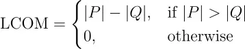
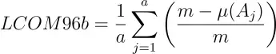
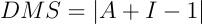
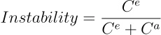
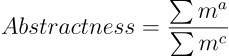

# Package design quality metrics

### Table of contents:

* [ LCOM ](#lack-of-cohesion-in-methodslcom)
* [ LCOM96b ](#lack-of-cohesion-in-methodslcom96b)
* [ DMS ](#distance-from-the-main-sequencedms)
* [ Instability ](#instability)
* [ Abstractness ](#abstractness)

## Lack of cohesion in methods(LCOM)

Where:

$P$ - number of pairs of methods in the class that do not share class fields

$Q$ - number of method pairs that share at least one class field

## Lack of cohesion in methods(LCOM96b)

$a$ - are number of attributes 

$m$ - are number of methods 

$\mu(A_j)$ - the number of methods accessing attribute $Aj$

## Distance from the main sequence(DMS)

Where:

$A$ - abstractness

$I$ - instability

## Instability

Where:

$C^e$ - number of efferent (or outgoing) dependencies

$C^a$ - number of afferent (or incoming) dependencies

## Abstractness

Where:

${\sum m^a}$ - sum of abstract elements (interfaces or abstract classes)

${\sum m^c}$ - sum of concrete elements (nonabstract classes, structs)

