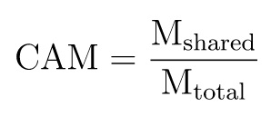
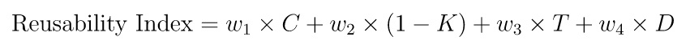

# Package design quality metrics

## Table of contents:

- Complexity
    - [ AMC ](#average-method-complexity-amc)
    - [ DMS ](#distance-from-the-main-sequencedms)
- Inheritance
    - [ Abstractness ](#abstractness)
- Coupling
    - [ Instability ](#instability)
- Cohesion
    - [ LCOM ](#lack-of-cohesion-in-methodslcom)
    - [ LCOM96b ](#lack-of-cohesion-in-methodslcom96b)
    - [ CAM ](#cohesion-among-methods-in-class-cam)
    - [ Reusability index ](#reusability-index)

## Complexity

### Average method complexity (AMC)

[CalcAMC](complexity.go#L14)

Where:

∑ MC - sum of the complexity of all methods in the class

n - total number of methods in a class

### Distance from the main sequence(DMS)

[CalcDMS](complexity.go#L35)

Where:

A - abstractness

I - instability

## Inheritance

### Abstractness

[CalcAbstractness](inheritance.go#L12)

Where:

∑ ma - sum of abstract elements (interfaces or abstract classes)

∑ mc - sum of concrete elements (nonabstract classes, structs)

## Coupling

### Instability

[CalcInstability](coupling.go#L12)

Where:

Ce - number of efferent (or outgoing) dependencies

Ca- number of afferent (or incoming) dependencies

## Cohesion

### Lack of cohesion in methods(LCOM)

[CalcLCOM](cohesion.go#L13)

Where:

P - number of pairs of methods in the class that do not share class fields

Q - number of method pairs that share at least one class field

### Lack of cohesion in methods(LCOM96b)

[CalcLCOM96b](cohesion.go#L32)

a - are number of attributes 

m - are number of methods 

μ(Aj) - the number of methods accessing attribute Aj

### Cohesion among methods in class (CAM)

[CalcCAM](cohesion.go#L68)

Where:

M shared - number of method pairs that share attributes

M total- total number of possible method pairs

### Reusability index

[CalcReusabilityIndex](cohesion.go#L90)

Where:

C - cohesion

K - coupling

T - testability

D - documentation

w1, w2, w3, w4 — weighting coefficients (the weighting coefficients are determined by the user)